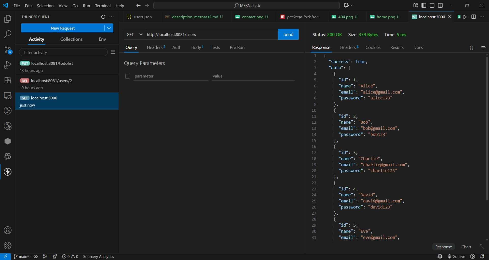
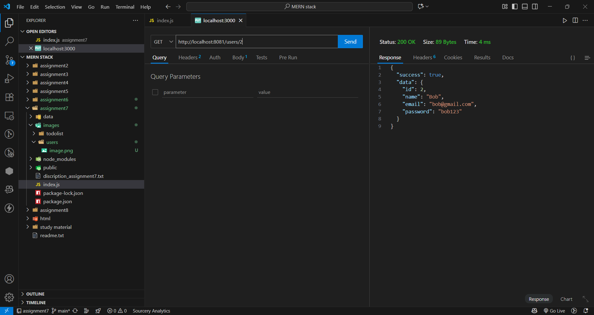
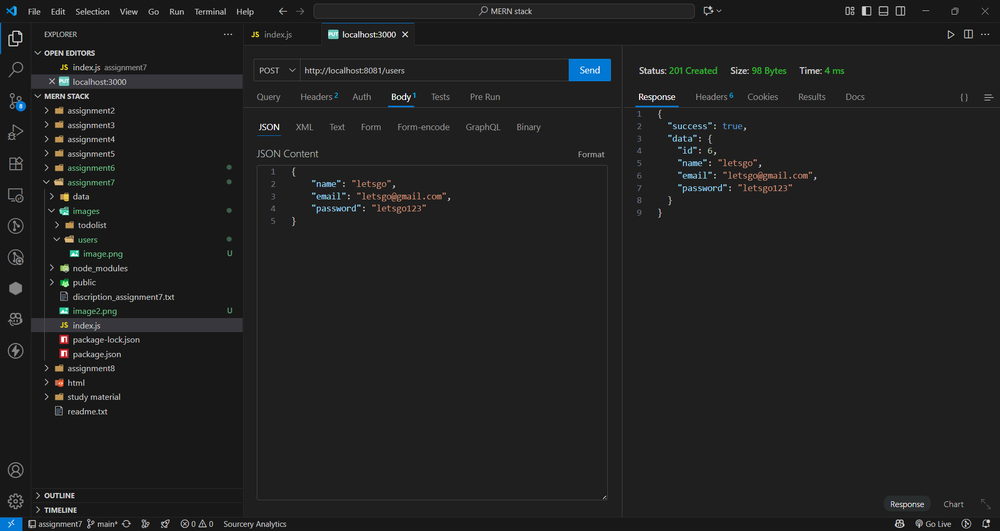
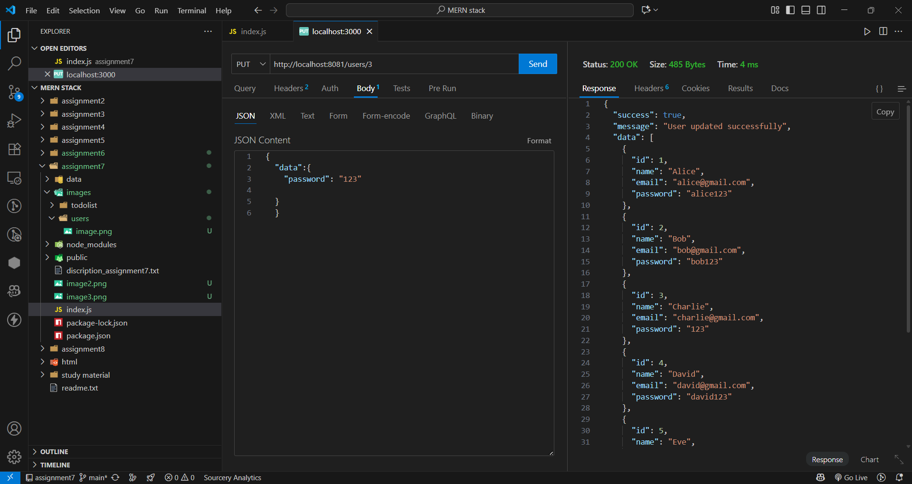
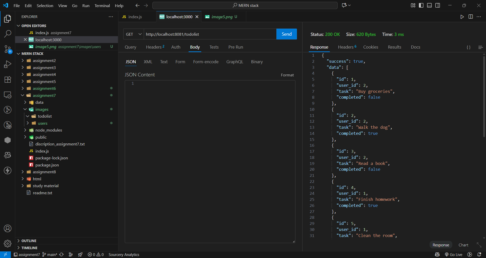
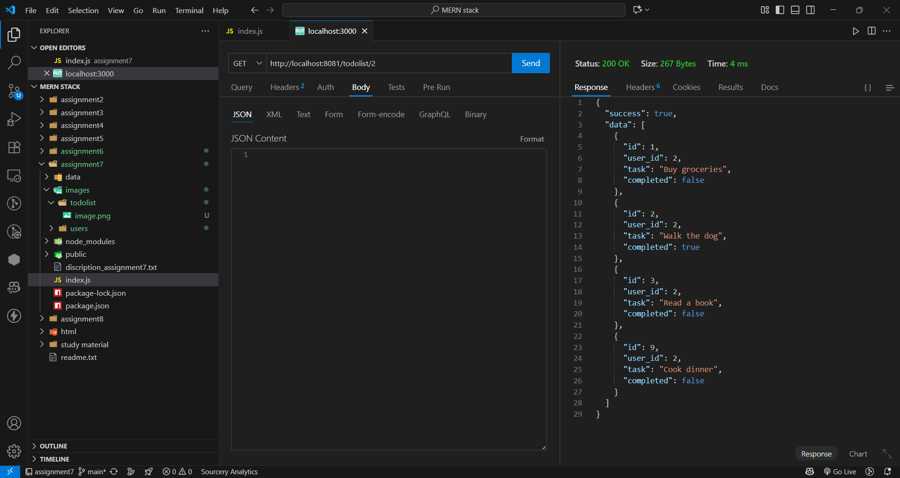
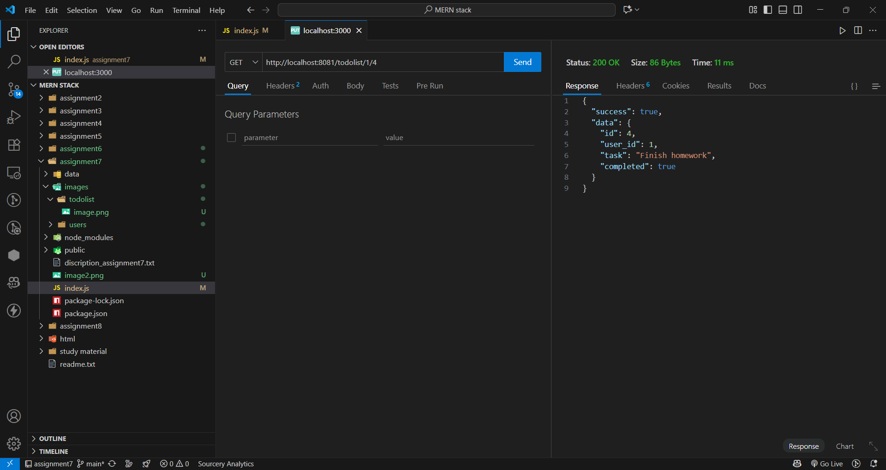
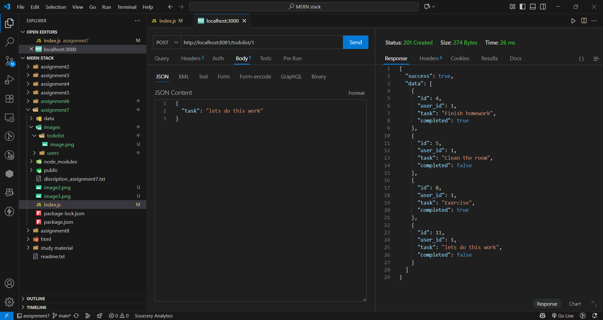
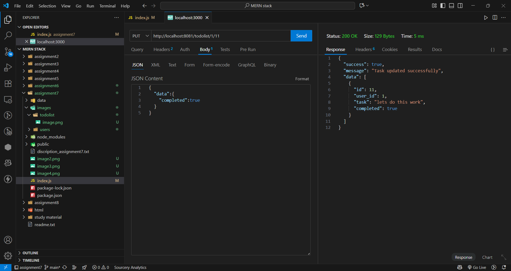
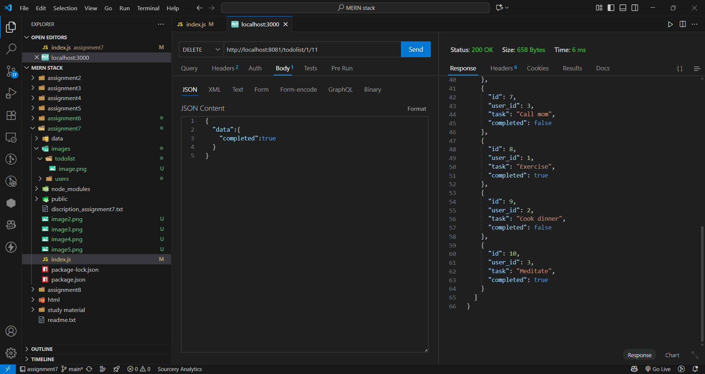

ToDoList Assignment 8
now connected to monogoDB atlas
you can create connection link and past it with password in .env file and then can use it

Now, here there are 2 set of APIs:
    1)User
    2)ToDoList

1)User:
    get =>http://localhost:8081/users => to get all existing users
    
    get =>http://localhost:8081/users/:id => to get user with specific id
    
    post =>http://localhost:8081/users => to creat a new user account (must have email which don't have account) input can be data(name, email, password)
    
    put =>http://localhost:8081/users/:id => enter user id which you want to update there information input can be data(name, email, password)
    
    delete =>http://localhost:8081/users/:id => to delete certain user account
    

2)ToDoList
    get =>http://localhost:8081/todolist => to get all existing tasks 
    
    get =>http://localhost:8081/todolist/:userid => to get all existing tasks of user with this user_id
    
    get =>http://localhost:8081/todolist/:userid/:taskid => to get existing task of user with this user_id and id
    
    post =>http://localhost:8081/todolist/:userid => to creat new task by user with this user_id input is task ans complete is by default false
    
    put =>http://localhost:8081/todolist/:userid/:taskid => to update certain task with id taskid input can be task and complete(option: true,false)
    
    delete =>http://localhost:8081/todolist/:userid/:taskid => to delete certain task with id taskid
    